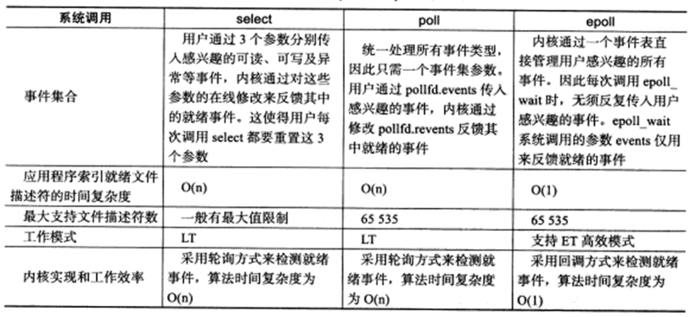

epoll将用户关心的文件描述符上的事件放在内核里的一个时间表中，从而无需像select和poll那样每次调用都要重复传入文件描述符或事件集，但epoll需要使用一个额外的文件描述符，来唯一标识内核中的这个事件表。
1. 创建文件描述符
```
#include<sys/epoll.h>
int epoll_create(int size);
```
2. 操作epoll的内核事件表
```
int epoll_ctl(int epfd, int op, int fd, struct epoll_event *event);
```
`fd`参数是要操作的文件描述符
`op`参数指定操作类型，操作类型有如下3种：
- EPOLL_CTL_ADD 往事件表中注册fd上的事件
- EPOLL_CTL_MOD 修改fd上的注册事件
- EPOLL_CTL_DEL 删除fd上的注册事件

`event`参数指定事件，它是`epoll_event`结构指针类型。`epoll_event`的定义如下：
```
struct epoll_event
{
    __unit32_t events; /*epoll事件*/
    epoll_data_t data;/*用户数据*/
}
```
事件类型如下：
- EPOLLIN ：表示对应的文件描述符可以读（包括对端SOCKET正常关闭）；
- EPOLLOUT：表示对应的文件描述符可以写；
- EPOLLPRI：表示对应的文件描述符有紧急的数据可读（这里应该表示有带外数据到来）；
- EPOLLERR：表示对应的文件描述符发生错误；
- EPOLLHUP：表示对应的文件描述符被挂断；
- EPOLLET： 将EPOLL设为边缘触发(Edge Triggered)模式，这是相对于水平触发(Level Triggered)来说的。
- EPOLLONESHOT：只监听一次事件，当监听完这次事件之后，如果还需要继续监听这个socket的话，需要再次把这个socket加入到EPOLL队列里

1. 在一段超时时间内等待一组文件描述符上的事件
```
int epoll_wait(int epfd struct epoll_event* events, int maxevents, int tiemout);
```
函数成功时返回就绪的文件描述符的个数，失败是返回-1并设置`errno`。

`timeout`参数指定超时值，单位是毫秒。`timeout`为-1时，将永远阻塞直到某个事件发生；为0
时，调用将立即返回。

`maxevents`参数指定最多监听多少个事件，必须大于0。

`epoll_wait`函数如果检测到事件，就将所有就绪的事件从内核事件表（有`epfd`参数指定）中复制到它的第二个参数`events`指向的数组中。这个数组只用于输出检测到的就绪时间，而不像select和poll的数组参数那样既用于传入用户注册的事件，有用于输出内核检测到的就绪事件。

4.LT和ET模式

对于采用LT工作模式的文件描述符，当epoll_wait检测到其上有事件发生并将此事件通知应用程序后，应用程序可以不立即处理该事件。这样，当应用程序下一次调用
epoll_wait时，epoll_wait还会再次向应用程序通告此事件，直到该事件被处理。

对于采用ET工作模式的文件描述符，当epoll_wait检测到其上有事件发生并将此事件通知应用程序后，应用程序必须立即处理该事件，因为后续的epollwait调用将不再向应用程序通知这一事件。

可见，ET模式在很大程度上降低了同一个epoll事件被重复触发的次数因此效率要比LT模式高。

5. select、poll和epoll区别

