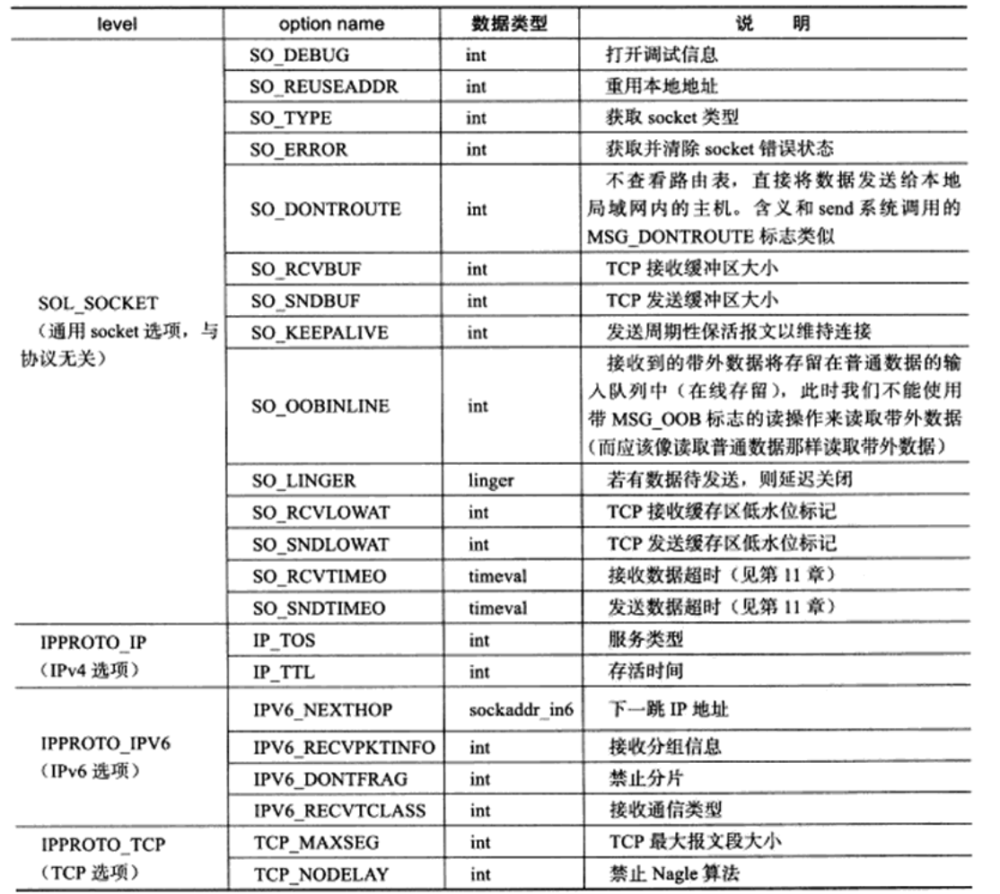
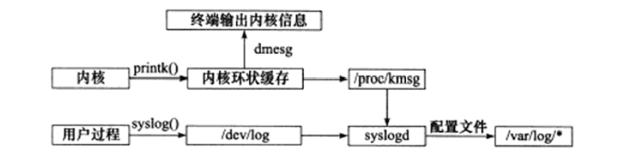
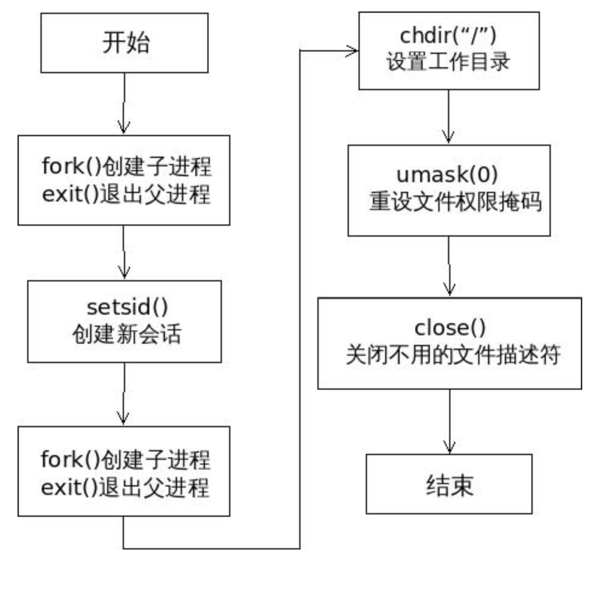
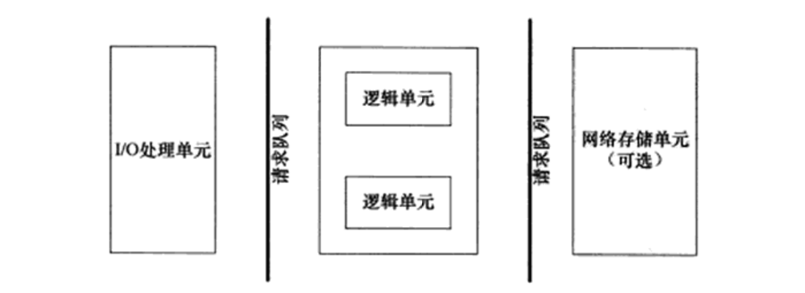

## Linux网络编程基础API
#### 1 socket地址API
##### 1.1 主机字节序和网络字节序
* 主机字节序是小端字节序
* 网路字节序是大端字节序
##### 1.2 通用socket地址
表示socket地址的是结构体**socketaddr**
```
#include <bits/socket.h>
struct sockaddr
{
    sa_family_t sa_family;//地址族类型通常与协议族类型对应
    char sa_data[14];//用于存放socket地址值
}
```
|协议族|地址族|描述
|---|---|---|
PF_UNIX|AF_UNIX|UNIX本地域协议族|
PF_INET|AF_INET|TCP/IPv4协议族|
PF_INET6|AF_INET6|TCP/IPv6协议族|

由于`sa_data`无法完全容纳多数协议族的地址值，Linux定义了新的通用socket地址结构体`sockaddr_storage`
##### 1.3 专用socket地址
* UNIX本地域协议族使用如下专用socket地址结构体
```
#include <sys/>un.h>
struct sockaddr_un
{
    sa_family_t sin_family;
    char sun_path[108];
}
```
* IPv4协议族使用如下专用socket地址结构体
```
struct sockaddr_in
{
    sa_family_t sin_family;
    u_int16_t sin_port;
    struct in_addr sin_addr;
}
```
* IPv6协议族使用如下专用socket地址结构体
```
struct sockaddr_in6
{
    sa_family_t sin6_family;
    u_int16_t sin6_port;
    u_int32_t sin6_flowinfo;//流信息，应设置为0
    struct in6_addr sin6_addr;
    u_int32_t sin6_scope_id;
}
```
所有专用socket地址类型的变量在实际使用时都需要转换成通用socket地址类型`sockaddr`
##### 1.4 IP地址转换函数
* `inet_addr` 将点分十进制字符串表示的IPv4地址转化为用网络字节序整数表示的IPv4地址
* `inet_aton`实现和`inet_addr`同样的功能，但是将转化结果存储到参数指向的地址结构中
* `inet_ntoa` 将用网络字节序整数表示的IPv4地址转化为用点分十进制字符串表示的IPv4地址
* `inet_pton`将用字符串表示的IP地址转化为用网络字节序整数表示的IP地址，并把转换结果存储于参数指向的内存中
* `inet_ntop`进行相反的转换，增加一个参数指定目标存储单元的大小
#### 2 创建socket 
```
#include <sys/types.h>
#include <sys/socket.h>
int socket(int domain, int type, int protocol)
```
* `domain`告诉系统使用哪个底层协议族
* `type`指定服务类型。主要由SOCK_STREAM（流服务）和SOCK_UGRAM（数据报服务）。也可以是上述服务类型与SOCK_NONBLOCK（将socket设置为非阻塞）和SOCK_CLOEXEC（用fork调用创建子进程是在子进程中关闭该socket）相与的值
* `protocol`设置为0，表示使用默认协议
#### 3 命名socket
将一个socket与socket地址绑定。在服务器程序中，通常要命名socket，这样客户端才能知道该如何连接它。客户端通常不需要命名socket，而是采用匿名方式，即使用操作系统自动分配的socket地址。
```
#include <sys/types.h>
#include <sys/socket.h>
int bind(int sockfd, const struct sockaddr* myaddr, socklen_t addrlen);
```
`bind`将`my_addr`所指的socket地址分配给未命名的`sockfd`文件描述符， `addrlen`参数指出该socket地址的长度
#### 4 监听socket
```
#include <sys/socket.h>
int listen(int sockfd, int backlog);
```
`sockfd`参数指定被监听的socket。 `backlog`参数提示内核监听队列的最大长度。监听队列的长度如果超过backlog，服务器将不受理新的客户连接，客户端也将收到ECONNREFUSED错误信息
#### 5 接受连接
```
#include <sys/types.h>
#include <sys/socket.h>
int accept(int sockfd, struct sockaddr* addr, socklen_t* addrlen);
```
`sockfd`参数是执行过`listen`系统调用的监听socket。`addr`参数用来获取被接受连接的远端socket地址，该socket地址的长度由`addrlen`参数指出。
`accept`成功时返回一个新的连接socket，该socket唯一地标识了被接受的这个连接，服务器可通过读写该socket与被接受连接对应的客户端通信。
#### 6 发起连接
服务器通过`listen`调用来被动接受连接，那么客户端需要通过`connect`系统调用来主动与服务器建立连接
```
#include <sys/types.h>
#include <sys/socket.h>
int connect(int sockfd, const sockaddr* serv_addr, socklen_t addrlen);
```
`sockfd`参数有`socket`系统调用返回一个socket。`serv_addr`参数是服务器监听的socket地址，`addrlen`参数则指定这个地址的长度。
`connect`成功时返回0。一旦成功建立连接，sockfd就唯一地标识了这个连接，客户端就可以通过读写sockfd来与服务器通信。

#### 7 关闭连接
```
#include <unistd.h>
int close(int fd);
```
`fd`参数是待关闭的socket。`close`系统调用并非总是立即关闭一个连接，而是将fd的引用计数减1。
无论如何都要立即终止连接，可以使用`shutdown`系统调用
```
#include <sys.socket.h>
int shutdown(int sockfd, int howto);
```
`sockfd`参数是待关闭的socket。`howto`参数决定了`shutdown`的行为。
|可选值|含义|
|---|---|
|SHUT_RD|关闭sockfd上读的这一半|
|SHUT_WR|关闭sockfd上写的这一半|
|SHUT_RDWR|同时关闭sockfd上读写|
#### 8 数据读写
* 对文件的读写操作`read`和`write`同样适用于socket
* 用于TCP流数据读写的系统调用
```
#include <sys.types.h>
#include <sys/socket.h>
ssize_t recv(int sockfd, void *buf, size_t len, int flags);
ssize_t send(int sockfd, const void *buf, size_t len, int flags);
```
* 用于UDP数据报读写的系统调用
```
#include <sys.types.h>
#include <sys/socket.h>
ssize_t recvfrom(int sockfd, void *buf, size_t len, int flags,struct sockaddr* src_addr, socklen_t* addrlen);
ssize_t sendto(int sockfd, const void *buf, size_t len, int flags,struct sockaddr* dest_addr, socklen_t addrlen);
```
* 通用的数据读写系统调用
```
#include <sys/socket.h>
ssize_t recvmsg(int sockfd, struct msghdr*msg, int flags);
ssize_t sendmsg(int sockfd, struct msghdr*msg, int flags);
```
#### 9 带外标记
Linux内核检测到TCP紧急标志（flags参数的可选值），将通知应用程序有带外数据需要接收。由两种常见通知方式：I/O复用产生的异常事件和SIGURG信号。然后通过如下系统调用获知带外数据在数据流中的具体位置
```
#include <sys/socket.h>
int sockatmark(int sockfd);
```
#### 10 地址信息函数
```
#include <sys/socket.h>
int getsockname(int sockfd, struct sockaddr* address, socklen_t* address_len);
int getpeername(int sockfd, struct sockaddr* address, socklen_t* address_len);
```
`getsockname`获取socket对应的本端socket地址，并将其存储于`address`参数指定的内存中，该地址的长度则存储于`address_len`参数指向的变量中
`getpeername`获取socket对应的远端socket地址
#### 11 socket选项
`fcntl`系统调用是控制文件描述符属性的通用POSIX方法，那么下面两个系统调用专门用来读取和设置socket文件描述符属性的方法
```
#include <sys/socket.h>
int getsockopt(int sockfd, int level, int option_name, void* option_value, socklen_t* restrict option_len);
int setsockopt(int sockfd, int level, int option_name, void* option_value, socklen_t option_len);
```


## 高级I/O函数
（1）用于创建文件描述符的函数，包括：pipe、dup/dup2函数 
（2）用于读写数据的函数，包括 readv/writev、sendfile、mmap/munmap、splice和tee函数
（3）用于控制I/O属性和行为的函数，包括fcntl函数

**1. pipe函数**
用于创建一个管道，实现进程间通信。
`socketpair`能够创建双向管道。
**2. dup函数和dup2函数**
将标准输入重定向到一个文件，或者把标准输出重定向到一个网络连接
**3. readv函数和writev函数**
readv函数将数据从文件描述符读到分散的内存块中，即分散读；writev函数则将多块分散的内存数据一并写入文件描述符中，即集中写
**4. sendfile函数**
实现在两个文件描述符之间直接传递数据（完全在内核中操作），从而避免了内核缓冲区和用户缓冲区之间的数据拷贝，效率很高，这被称为零拷贝
**5. mmap函数和munmap函数**
mmap函数用于申请一段内存空间。我们可以将这段内存作为进程间通信的共享内存，也可以将文件直接映射到其中。munmap函数则释放有mmap创建的这段内存空间
**6. splice函数**
用于在两个文件描述符之间移动数据，也是零拷贝操作。用splice时， fd_in和fd_out中必须至少有一个是管道文件描述符
**7. tee函数**
在两个管道文件描述符之间复制数据，也是零拷贝操作。它不消耗数据，因此源文件描述符上的数据仍然可以用于后续的读操作
**8. fcntl函数**
提供了对文件描述符的各种控制操作

## Linux服务器程序规范
#### 1. 日志
##### 1.1 Linux系统日志
Linux提供一个守护进程（后台进程）来处理系统日志——syslogd、**rsyslogd**

##### 1.2 syslog函数
应用程序使用`syslog`函数与rsyslogd守护进程通信。
`openlog`函数可以改变syslog的默认输出方式，进一步结构化日志内容。
`setlogmask`设置syslog的日志掩码，使日志级别大于日志掩码的日志信息被系统忽略。
`closelog`关闭日志功能。
#### 2. 用户信息
##### 2.1 UID、EUID、GID和EGID
```
uid_t getuid();//获取真实用户ID
uid_t geteuid();//获取有效用户ID
gid_t getgid();//获取真实组ID
gid_t getegid();//获取有效组ID
int setuid(uid_t uid);//设置真实用户ID
int seteuid(uid_t uid);//设置有效用户ID
int setgid(gid_t gid);//设置真实组ID
int setgid(gid_t gid);//设置有效组ID
```
* 实际用户ID(实际组ID):标识当前用户(所属组)是谁,当用户登陆时取自口令文件。
* 有效用户ID(有效组ID):用来决定我们(当前进程)对文件的访问权(即实际该进程的是以那个用户运行的)。
* 一般情况下,进程的有效用户ID等于进程的实际用户ID,进程的有效用户组ID等于进程的实际用户组ID。
* 但是当可执行程序文件的文件模式(st_mode)中设置了“设置-用户-ID(set_user_id)位”时,进程的有效用户ID等于该可执行文件的拥有者ID。
##### 2.2 切换用户
使用setgid和setuid将以root身份启动的进程切换为以一个普通用户身份运行。
#### 3. 进程间关系
##### 3.1 进程组
* Linux下每个进程都隶属于一个进程组，因此它们除了PID信息外，还有进程组ID（PGID）。可以使用`getpgid`获取指定进程的PGID。
* 每个进程组都有一个首领进程，其PGID和PID相同。可以使用`setpgid`设置PGID。
  * 函数作用：将pid进程的进程组ID设置成pgid，创建一个新进程组或加入一个已存在的进程组
  * 函数性质：
    性质1：一个进程只能为自己或子进程设置进程组ID，不能设置其父进程的进程组ID。
    性质2：如果pid等于pgid, 由pid指定的进程变成进程组首领;即进程pid的进程组ID pgid=pid。
    性质3：如果pid等于0,将当前进程的pid作为进程组ID。
    性质4：如果pgid等于0,将pid作为进程组ID。
##### 3.2 会话
一些有关联的进程组将形成一个会话。可以使用`setsid`创建一个会话。
（1）调用setsid的进程不能是一个进程组的首领，此函数创建一个新的会话。
（2）此进程变成该会话的首领，此时该进程是新会话的唯一成员。
（3）新建一个进程组，调用进程成为该组的首领。
（4）此进程没有控制终端，如果在调用setsid前，该进程有控制终端，那么与该终端的联系被解除。
##### 3.3 ps命令查看进程关系
#### 4. 系统资源限制
Linux上运行的程序都会受到资源限制的影响，比如物理设备限制（CPU数量、内存大小）、系统策略限制（CPU时间）、具体实现限制（文件名最大长度）等。
可以通过`getrlimit`和`setrlimit`来读取和设置Linux系统资源限制。
#### 5. 改变工作目录和根目录
获取进程当前工作目录和改变进程工作目录的函数分别是`getcwd`和`chdir`。
改变进程根目录的函数是`chroot`。
#### 6. 服务器程序后台化
可以使用`daemon`让一个进程以守护进程的方式运行。
遵循下面的步骤
###### 1. fork()创建子进程，父进程exit()退出
这是创建守护进程的第一步。由于守护进程是脱离控制终端的，完成这一步后就会在Shell终端里造成程序已经运行完毕的假象。之后的所有工作都在子进程中完成，而用户在Shell终端里则可以执行其他命令，从而在形式上做到了与控制终端的脱离，在后台工作。由于父进程先于子进程退出，子进程就变为孤儿进程，并由 init 进程作为其父进程收养。
###### 2. 在子进程调用setsid()创建新会话
在调用了 fork() 函数后，子进程全盘拷贝了父进程的会话期、进程组、控制终端等，虽然父进程退出了，但会话期、进程组、控制终端等并没有改变。这还不是真正意义上的独立开来，而 setsid() 函数能够使进程完全独立出来。
   * setsid()创建一个新会话，调用进程担任新会话的首进程，其作用有：
    使当前进程脱离原会话的控制
    使当前进程脱离原进程组的控制
    使当前进程脱离原控制终端的控制
    这样，当前进程才能实现真正意义上完全独立出来，摆脱其他进程的控制。
###### 3. 再次 fork() 一个子进程，父进程exit退出
现在，进程已经成为无终端的会话组长，但它可以重新申请打开一个控制终端，可以通过 fork() 一个子进程，该子进程不是会话首进程，该进程将不能重新打开控制终端。退出父进程。
也就是说通过再次创建子进程结束当前进程，使进程不再是会话首进程来禁止进程重新打开控制终端。
###### 4. 在子进程中调用chdir()让根目录“/”成为子进程的工作目录
这一步也是必要的步骤。使用fork创建的子进程继承了父进程的当前工作目录。由于在进程运行中，当前目录所在的文件系统（如“/mnt/usb”）是不能卸载的，这对以后的使用会造成诸多的麻烦（比如系统由于某种原因要进入单用户模式）。因此，通常的做法是让"/"作为守护进程的当前工作目录，这样就可以避免上述的问题，当然，如有特殊需要，也可以把当前工作目录换成其他的路径，如/tmp。改变工作目录的常见函数是chdir。(避免原父进程当前目录带来的一些麻烦)
###### 5. 在子进程中调用umask()重设文件权限掩码为0
文件权限掩码是指屏蔽掉文件权限中的对应位。比如，有个文件权限掩码是050，它就屏蔽了文件组拥有者的可读与可执行权限（就是说可读可执行权限均变为7）。由于使用fork函数新建的子进程继承了父进程的文件权限掩码，这就给该子进程使用文件带来了诸多的麻烦。因此把文件权限掩码重设为0即清除掩码（权限为777），这样可以大大增强该守护进程的灵活性。通常的使用方法为umask(0)。(相当于把权限开发)
###### 6. 在子进程中close()不需要的文件描述符
同文件权限码一样，用fork函数新建的子进程会从父进程那里继承一些已经打开了的文件。这些被打开的文件可能永远不会被守护进程读写，但它们一样消耗系统资源，而且可能导致所在的文件系统无法卸下。其实在上面的第二步之后，守护进程已经与所属的控制终端失去了联系。因此从终端输入的字符不可能达到守护进程，守护进程中用常规方法（如printf）输出的字符也不可能在终端上显示出来。所以，文件描述符为0、1和2 的3个文件（常说的输入、输出和报错）已经失去了存在的价值，也应被关闭。（关闭失去价值的输入、输出、报错等对应的文件描述符）
###### 7. 守护进程退出处理
当用户需要外部停止守护进程运行时，往往会使用 kill 命令停止该守护进程。所以，守护进程中需要编码来实现 kill 发出的signal信号处理，达到进程的正常退出。


## 高性能服务器程序框架
#### 1. 服务器模型
##### 1.1 C/S模型
* 所有客户端都通过访问服务器来获取所需的资源。
* 客户连接请求是随机到达的异步事件。
* 适合资源相对集中的场合，服务器是通信的中心，当访问量过大时可能所有用户都将得到很慢的响应。
##### 1.2 P2P模型
* P2P模型使得每台机器在消耗服务的同时也给别人提供服务，这样资源能够充分、自由地共享。
* 当用户之间传输的请求过多时，网络的负载将加重。
* 通常带有一个专门的发现服务器，便于主机之间相互发现。
#### 2. 服务器编程框架

| 模块 | 单个服务程序 | 服务器机群|
| --- | --- | --- |
I/O处理单元 | 处理客户连接，读写网络数据 |作为接入服务器实现负载均衡|
| 逻辑单元    | 业务进程或线程           | 逻辑服务器|
| 网络存储单元 | 本地数据库、文件或缓存  |数据库服务器|
| 请求队列    | 各单元之间的通信方式      | 各服务器之间的永久TCP连接
#### 3. I/O模型
* 阻塞I/O：即阻塞的文件描述符。针对阻塞I/O执行的系统调用可能因为无法立即完成而被操作系统挂起，知道等待的事情发声位置。可能被阻塞的系统调用包括accept、send、recv和connect。
* 非阻塞I/O：即非阻塞的文件描述符。针对非阻塞I/O执行的系统调用总是立即返回，而不管事件是否已经发生。
* 可以给socket系统调用第二个参数传递SOCK_NONBLOCK标志，或者通过fcntl的F_SETFL命令将其设置为非阻塞。如果非阻塞I/O的事件没有立即发生，返回-1并设置errno。对于accept、send和recv事件未发生时errno通常被设置成EAGAIN（再来一次）或者WEOULDBLOCK(期望阻塞)，对于connect，errno被设置为EINPROGRESS（在处理中）。
* 只有在事件已经发生的情况下操作非阻塞I/O，才能提高程序的效率。因此非阻塞I/O通常要和其他I/O通知机制一起使用，比如I/O复用和SIGIO信号。
    > 虽然非阻塞I/O允许进程或线程在等待I/O操作完成时继续执行其他任务，但它也带来了一个问题：如何知道I/O操作何时完成？如果进程或线程不断地轮询（即不断检查）I/O操作的状态，这将浪费大量的CPU资源，导致效率低下。因此，非阻塞I/O通常与其他I/O通知机制一起使用，以便在I/O操作完成时得到通知，而不是通过轮询来检查。

    > I/O复用函数本身是阻塞的，它们能提高效率得益于能同时监听多个I/O事件的能力。当调用一个I/O复用函数时，实际上是在告诉操作系统：“我想要知道这些文件描述符中的哪些已经准备好进行读、写或异常处理。请在我得到答案之前不要返回。”这种阻塞性质与传统的阻塞I/O操作相似，但关键的区别在于I/O复用函数允许同时监视多个文件描述符，而不仅仅是一个。
* 阻塞I/O、I/O复用和信号驱动I/O都是同步I/O模型。I/O的读写操作，都是在I/O事件发生之后，由应用程序来完成。
* 对于异步I/O，用户可以直接对I/O执行读写操作，这些操作告诉内核用户读写缓冲区的位置，以及I/O操作完成后内核通知应用程序的方式。异步I/O的读写操作总是立即返回，而不论I/O是否是阻塞的，真正的读写操作由内核接管。

#### 4. 两种高效的事件处理模式
服务器程序通常要处理三类事件：I/O事件、信号及定时事件。同步I/O模型通常用于实现Reactor模式，异步I/O模型通常用于实现Proactor模式。
##### 4.1 Reactor模型
主线程（I/O处理单元）只负责监听文件描述符上是否有事件发生，有的话就立即将该事件通知工作线程（逻辑单元）。读写数据，接收新的连接，以及处理客户请求均在工作线程中完成。
##### 4.2 Proactor模型
所有I/O操作都交给主线程和内核来处理，工作线程仅仅负责业务逻辑。
#### 5. 两种高效的并发模式
并发编程主要有多进程和多线程两种方式。并发模式是指I/O处理单元和多个逻辑单元之间协调完成任务的方法。
##### 5.1 半同步/半异步模式
* 并发模式中的“同步”是指程序完全按照代码序列的顺序执行，“异步”是指程序的执行需要由系统事件（中断、信号等）来驱动。
* 按照同步方式运行的线程称为同步线程，效率相对较低，实时性差，但逻辑简单。按照异步方式运行的线程称为异步线程，执行效率高，实时性强，但复杂难于调试和扩展。
* 半同步/半异步模式中，同步线程处理客户逻辑，异步线程用于处理I/O事件。
##### 5.2 领导者/追随者模式
* 领导者/追随者模式是多个工作线程轮流获得事件源集合，轮流监听、分发并处理事件的一种模式。
* 在任意时间点，只有一个线程（领导者）负责监听I/O事件，而其他线程（追随者）则休眠在线程池中等待成为新的领导者。
* 领导者线程负责监听I/O事件。一旦检测到事件，它会首先从线程池中推选出新的领导者线程，然后处理该I/O事件。新的领导者线程等待新的I/O事件，而旧的领导者线程则继续处理当前事件。这样，多个线程可以轮流处理事件，实现并发。
* 领导者/追随者模式主要由以下几个部分构成：
    * 句柄集：用于管理多个I/O资源的句柄（Handle），在Linux下通常是文件描述符。
    * 线程集：是所有线程的管理者，负责线程之间的同步以及推选新的领导者。
    * 事件处理器（EventHandler）：通常包含一个或多个回调函数handle_event，用于处理事件对应的业务逻辑。
    * 具体事件处理器（ConcreteEventHandler）：是事件处理器的具体实现，负责执行实际的事件处理逻辑。
#### 6. 有限状态机
实现HTTP请求的读取和分析
#### 7. 提高服务器性能的其他建议
##### 7.1 池
* 池是一组资源的集合，这组资源在服务器启动之初就被完全创建好并初始化，被称为静态资源分配。
* 内存池通常用于socket的接收缓存和发送缓存。进程池和线程池在并发编程中常常用到。
##### 7.2 数据复制
应避免不必要的数据复制，尤其是当数据复制发生在用户代码和内核之间。用户代码内部的数据复制也应该避免，当两个进程之间要传递大量的数据时，应该考虑使用共享内存来在它们之间直接共享数据，而不是使用管道或消息队列来传递。
##### 7.1 上下文切换和锁
* 并发程序必须考虑上下文切换问题即进程切换或线程切换导致的系统开销。
* 服务器如果有更好地解决方案，应该避免使用锁。

## 信号
信号是由用户、系统或进程发送给目标进程的信息，以通知目标进程某个状态的改变或系统异常。
Linux信号产生条件：
* 对于前台进程，可输入特殊的终端字符来给它发送信号，例如输入Ctrl+C通常会给进程发送一个中断信号。
* 系统异常。
* 系统状态变化。
* 运行kill命令或调用kill函数。
#### 1. Linux信号概述
##### 1.1 发送信号
Linux下，一个进程给其他进程发送信号的API是`kill`函数。
##### 1.2 信号处理方式
* 目标进程在收到信号时，需要定义一个接收函数来处理，用户 可以提供自己的信号处理函数，然后使用signal函数将处理函数加载。信号处理函数应该是可重入的，否则容易引发一些竞态条件。
* SIG_IGN表示忽略目标信号。
* SIG_DEL表示使用信号的默认处理方式。
##### 1.3 Linux信号
Linux的可用信号都定义在bits/signum.h头文件中。
##### 1.4 中断系统调用
如果程序在执行处于阻塞状态的系统调用时接收到信号，并且我们为该信号设置了信号处理函数，则默认情况下系统调用将被中断，并且errno被设置为EINTR。
#### 2. 信号函数
##### 2.1 signal系统调用
要为一个信号设置处理函数，可以使用`signal`系统调用。
##### 2.1 sigaction系统调用
设置信号处理函数的更健壮的接口。
#### 3. 信号集
##### 3.1 信号集函数
Linux使用数据解构sigset_t来表示一组信号。Linux提供如下一组函数来设置、修改、删除、查询信号集：
* `sigemptyset` 清空信号集
* `sigfillset` 在信号集中那个设置所有信号
* `sigaddset` 将信号添加至信号集中
* `sigdelset` 将信号从信号集中删除
* `sigismember` 测试信号是否在信号集中
##### 3.2 进程信号掩码
`sigprocmask`可用于设置或查看进程的信号掩码，以指定哪些信号不能发送给本进程。
##### 3.3 被挂起的信号
* 设置进程信号掩码后，被屏蔽的信号将不能被进程接收。如果向进程发送一个被屏蔽的信号，则操作系统将该信号设置为进程的一个被挂起的信号。如果我们取消对被挂起信号的屏蔽，则它能立即被进程接收到。
* `sigpending`函数可以获得进程当前被挂起的信号。
* fork调用产生的子进程将继承父进程的信号掩码，但具有一个空的挂起信号集。
#### 4. 统一事件源
* 信号是一种异步事件，信号处理函数和程序的主循环是两条不同的执行路线。
* 信号处理函数需要尽快执行完毕，以确保信号不能屏蔽太久（为了避免一些竞态条件，信号在处理期间，系统不会再次触发它）。
* 一种解决方案是：把信号的主要处理逻辑放到程序的主循环中，当信号处理函数被触发时，它只是简单地通知主循环程序接收到信号，并把信号值传递给主循环，主循环再根据接收到的信号值执行目标信号对应的逻辑代码。
* 信号处理函数通常使用管道来将信号传递给主循环。在主循环中使用I/O复用系统调用来监听管道的读端文件描述符上的可读事件。这样信号事件就能和其他I/O事件一样被处理，即统一事件源。
#### 5. 网络编程相关信号
##### 5.1 SIGHUP
* 当挂起进程的控制终端时，SIGHUP信号将被触发。
* 对于没有控制终端的网络后台程序而言，它们通常利用SIGHUP信号来强制服务器重读配置文件。
##### 5.2 SIGPIPE
* 默认情况下，往一个读端关闭的管道或者socket连接中写数据将引发SIGPIPE信号。
* 因为程序接收到SIGPIPE信号的默认行为是结束进程，我们不希望因为错误的写操作而导致程序退出，因此需要在代码中捕获并处理该信号或者忽略它。
* 这种情况下，我们应该使用send函数反馈的errno值或者I/O复用系统（触发事件）来判断管道或者socket连接的读端是否已经关闭。
##### 5.3 SIGURG
内核通知应用程序带外数据到达主要由两种方法：
* I/O复用技术
* 使用SIGURG信号 

## 定时器
定时是指在一段时间之后触发某段代码的机制。我们将每个定时事件分别封装成定时器，并使用某种容器类数据结构，比如链表、排序链表和时间轮，将所有定时器串联起来，以实现对定时事件的统一管理。
Linux提供三种定时方法：
1. socket选项SO_RCVTIMEO和SO_SNDTIMEO
    * 这两个选项仅对与数据接收和发送相关的socket专用系统调用（send、sendmsg、recv、recvmsg、accept和connect）有效。
    * 我们可以根据系统调用的返回值以及errno来判断超时时间是否已到，进而决定是否开始处理定时任务。
2. SIGALRM信号
由alarm和setitimer函数设置的实时闹钟一旦超时，将触发SIGALRM信号。
    * 基于升序链表的定时器
    * 处理非活动连接
3. I/O复用系统调用的超时参数
Linux下的三组I/O复用系统调用都带有超时参数，因此它们不仅能统一处理信号和I/O事件，也能统一处理定时事件。
如果要利用它们来定时，就需要不断更新定时参数以反映剩余的时间。
4. 高性能定时轮
5. 时间堆 

## 多进程编程
#### 1. fork系统调用
Linux下创建新进程的系统调用是fork。
* 在父进程中返回的是子进程的PID，在子进程中则返回0。
* 新的进程表项有很多属性与原进程相同，比如堆指针、栈指针和标志寄存器的值。但也有许多属性被赋予了新的值，比如该进程的PPID被设置成源进程的PID，信号位图被清除。
* 子进程和父进程代码完全相同，数据的复制采用写时复制。但是如果我们在程序中分配了大量内存，那么使用fork是也应当十分谨慎，尽量避免没必要的内存分配和数据复制。
* 创建子进程后，父进程打开的文件描述符默认在子进程中也是打开的，且引用计数加1，父进程的用户根目录、当前工作目录等变量的引用计数均会加1。
#### 2. exec系列系统调用
若需要在子进程中执行其他程序，即替换当前进程映像，这就需要使用exec系列函数之一。
#### 3. 处理僵尸进程
僵尸态：
* 子进程结束运行之后，父进程读取其退出状态之前。
* 父进程结束或者异常终止，而子进程继续运行。（此时子进程的PPID将被操作系统设置为1，即init进程）

wait、waitpid函数在父进程中调用，以等待子进程的结束，并获取子进程的返回信息，从而避免了僵尸进程的产生，或者使子进程的僵尸态立即结束。
#### 4. 管道
* 管道也是父进程和子进程间通信的常用手段。
* 管道能在父、子进程间传递数据，利用的是fork调用之后两个管道文件描述符（fd[0]和fd[1]）都保持打开。
* 一对这样的文件描述符只能保证父、子进程间一个方向的数据传输，父、子进程必须有一个关闭fd[0]，另一个关闭fd[1]。
* 若要实现父、子进程之间的双向数据传输，就必须使用两个管道。socket编程接口提供了一个创建全双工管道的系统调用：socketpair。
* 管道只能用于有关联的两个进程（比如父、子进程）间的通信。
#### 5. 信号量
Linux信号量的API都定义在sys/sem.h头文件中，它们都被设计为操作一组信号量，即信号量集，而不是单个信号量。
* semget系统调用创建一个新的信号量集，或者获取一个已经存在的信号量集。
* semop系统调用改变信号量的值，即执行P、V操作。
* semctl系统调用允许调用者对信号量进行直接控制。
#### 6. 共享内存
共享内存是最高效的IPC机制，因为它不涉及进程之间的任何数据传输。但我们必须用其他辅助手段来同步进程对共享内存的访问，否则会产生竞态条件，因此共享内存通常和其他进程间通信方式一起使用。
Linux共享内存的API都定义在sys/shm.h头文件中。
* shmget系统调用创建一段新的共享内存，或者获取一段已经存在的共享内存。
* 共享内存被创建/获取后，不能立即访问它，而是需要使用shmat系统调用先将它关联到进程的地址空间中。
* 使用完共享内存后，需要使用shmdt系统调用将它从进程地址空间中分离。
* shmctl系统调用控制共享内存的某些属性。 
共享内存的POSIX方法：
1. 使用shm_open()创建或打开一个POSIX共享内存对象。
2. 使用mmap()把共享内存映射到进程的虚拟地址空间里。
3. 使用shm_unlink删除创建的共享内存对象。
#### 7. 消息队列
消息队列是在两个进程之间传递二进制块数据的一种简单有效的方式。每个数据块都有一个特定的类型，接收方可以根据类型来有选择地接受数据，而不一定像管道和命名管道那样必须以先进先出的方式接收数据。
Linux消息队列的API都定义在sys/msg.h头文件中。
* msgget系统调用创建一个或获取一个已有的消息队列。
* msgsnd系统调用把一条消息添加到消息队列中。
* msgrcv系统调用从消息队列中获取消息。
* msgctl系统调用控制消息队列的某些属性。
#### 8. IPC命令
当程序调用semget、shmget、msgget时，就创建了这些共享资源的一个实例。
Linux提供了ipcs命令以观察当前系统上拥有哪些共享资源实例。
#### 9. 进程间传递文件描述符
传递一个文件描述符并不是传递一个文件描述符的值，而是要在接收进程中创建一个新的文件描述符，并且该文件描述符和发送进程中被传递的文件描述符指向内核中相同的文件表项。
在Linux下我们可以利用UNIX域的socket在进程间传递特殊的辅助数据，以实现文件描述符的传递。

## 多线程编程
#### 1. Linux线程概述
##### 1.1 线程模型
* 线程是程序中完成一个独立任务的完整执行序列，即一个可调度的实体。内核线程运行在内核空间，由内核调度；用户线程运行在用户空间，由线程库来调度。
* 线程实现方式可分为三种模式： 
  * 完全在用户空间实现，创建和调度线程都无需内核干预，速度快；即使一个进程创建了很多线程，也不会对系统性能造成明显的影响；对于多处理器系统一个进程的多个线程无法运行在不同CPU上。
  * 完全由内核调度，创建、调度线程的任务都交给了内核，优缺点与上一个互换。
  * 双层调度模式，是前两种实现模式的混合体，结合了前两种方式的优点。
##### 1.2 Linux线程库
现代Linux上默认使用的线程库是NPTL。
#### 2. 创建线程和结束线程
Linux系统上，创建和结束线程的基础API都定义在pthread.h头文件中。
1. `pthread_create`：创建一个线程
2. `pthread_exit`：线程函数在结束时最好调用该函数以确保安全、干净地退出
3. `pthread_join`：一个进程中的所有线程都可以调用该函数来回收其他线程
4. `pthread_cancel`：异常终止一个线程，即取消线程
#### 3. 线程属性
`pthread_attr_t`结构体定义了一套完整的线程属性。各种线程属性都包含在一个字符数组中。
`pthread_attr_init`初始化线程属性对象
`pthread_attr_destroy`销毁线程属性对象
线程库还定义了一系列函数来获取、设置线程属性。线程属性包括有：
`detachstate`:线程的脱离状态
`stackaddr和stacksize`:线程d堆栈的起始地址和大小
`guardsize`:保护区域大小
`schedparam`:线程调度参数
`schedpolicy`:线程调度策略
`inheritsched`:是否继承调用线程的调度属性
`scope`:线程间竞争CPU的范围，即线程优先级的有效范围
#### 4. POSIX信号量
有3种专门用于线程同步的机制：POSIX信号量、互斥量和条件变量。
Linux上，信号量有两组API。一组是System V IPC信号量，一组是POSIX信号量。这两组接口很相似，但不保证能互换。
`sem_init`初始化一个未命名的信号量
`sem_destroy`用于销毁信号量，以释放其占用的内核资源
`sem_wait`以原子操作的方式将信号量的值减1
`sem_trywait`始终立即返回，而不论被操作的信号量是否具有非0值，相当于sem_wait的非阻塞版本
`sem_post`以原子操作的方式将信号量的值加1
#### 5. 互斥锁
互斥锁（也称互斥量）可以用于保护关键代码段，以确保其独占式的访问。
##### 5.1 互斥锁基础API
`pthread_mutex_init`初始化互斥锁
`pthread_mutex_destroy`用于销毁互斥锁，以释放其占用的内核资源
`pthread_mutex_lock`以原子操作的方式给一个互斥锁加锁
`pthread_mutex_trylock始终立即返回，而不论被操作的互斥锁是否已经被加锁，相当于pthread_mutex_lock的非阻塞版本
`pthread_mutex_unlock以原子操作的方式给一个互斥锁解锁
##### 5.2 互斥锁属性
`pthread_mutexattr_t`结构体定义了一套完整的互斥锁属性。线程库提供了一系列函数来获取和设置互斥锁属性。
#### 6. 条件变量
互斥锁用于同步线程对共享数据的访问，条件变量用于在线程之间同步共享数据的值。条件变量提供了一种线程间的通知机制：当某个共享数据达到某个值的时候，唤醒等待这个共享数据的线程。
`pthread_cond_init`初始化条件变量
`pthread_cond_destroy`用于销毁条件变量，以释放其占用的内核资源
`pthread_cond_broadcast`以广播的方式唤醒所有等待目标表条件变量的线程
`pthread_cond_signal`唤醒一个等待目标条件变量的线程
`pthread_cond_wait`用于等待目标条件变量
#### 7. 线程同步机制包装类
#### 8. 多线程环境
##### 8.1 可重入函数
如果一个函数能被多个线程同时调用且不发生竞态条件，则我们称它是线程安全的，或者说它是可重入函数。那些不可重入的库函数主要是因为内部使用了静态变量。在多线程程序中调用库函数，一定要使用其可重入版本。
##### 8.2 线程和进程
pthread提供了一个专门的函数`pthread_atfork`，以确保调用后父进程和子进程都拥有一个清楚的锁状态。
##### 8.2 线程和信号
* 每个线程都可以独立地设置信号掩码，多线程环境下我们应使用pthread版本的sigprocmask函数`pthread_sigmask`来设置线程信号掩码。
* 进程中的所有线程共享该进程的信号，所以线程库将根据线程掩码决定把信号发送给哪个具体线程。如果我们在每个子线程中都单独设置信号掩码容易导致逻辑错误，同时所有线程共享信号处理函数，因此我们应定义一个专门的线程来处理所有的信号。通过以下两个步骤实现：
  * 在主线程创建出其他子线程之前就调用pthread_sigmask来设置好信号掩码，所有新创建的子线程都将自动继承这个信号掩码。
  * 在某个线程中调用sigwait来等待信号并处理。
## 进程池和线程池  
