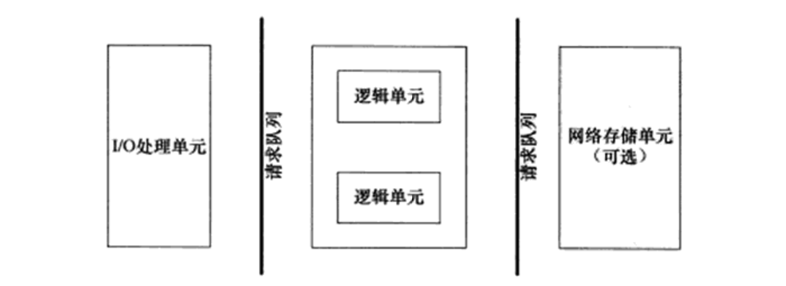

  ### TinyWebServer
  * **1. 网络服务器**
    * *定义*：是一个服务器软件（程序），或者是运行这个服务器软件的硬件（计算机）
    * *主要功能*：是通过HTTP协议与客户端（通常是浏览器（Browser））进行通信，来接收，存储，处理来自客户端的HTTP请求，并对其请求做出HTTP响应，返回给客户端其请求的内容（文件、网页等）或返回一个Error信息。
    * *编程框架*
      
      | 模块 | 单个服务程序 | 服务器机群|
      | --- | --- | --- |
        I/O处理单元 | 处理客户连接，读写网络数据 |作为接入服务器实现负载均衡|
      | 逻辑单元    | 业务进程或线程           | 逻辑服务器|
      | 网络存储单元 | 本地数据库、文件或缓存  |数据库服务器|
      | 请求队列    | 各单元之间的通信方式      | 各服务器之间的永久TCP连接
  * **2. 与Web服务器通信**
    * 在浏览器中键入“域名”或“IP地址:端口号”，浏览器则先将域名解析成相应的IP地址或者直接根据IP地址向对应的Web服务器发送一个HTTP请求。这一过程首先要通过TCP协议的三次握手建立与目标Web服务器的连接，然后HTTP协议生成针对目标Web服务器的HTTP请求报文，通过TCP、IP等协议发送到目标Web服务器上。
  * **3. Web服务器接收客户端发来的HTTP请求报文**
    * Web服务器端通过socket监听来自用户的请求
    * 服务器通过**epoll**这种I/O复用技术（还有select和poll）来实现对监听socket（`listenfd`）和连接socket（客户请求）的同时监听。
    * 为提高效率，将在这部分通过线程池来实现并发（多线程并发），为每个就绪的文件描述符分配一个逻辑单元（线程）来处理。
    * 服务器程序通常需要处理三类事件：**I/O事件**，**信号**，**定时事件**。
    * 两种事件处理模式：
        * **Reactor模式**：要求主线程（I/O处理单元）只负责监听文件描述符上是否有事件发生（可读、可写），若有，则立即通知工作线程（逻辑单元），将socket可读可写事件放入请求队列，交给工作线程处理。
        * **Proactor模式**：将所有的I/O操作都交给主线程和内核来处理（进行读、写），工作线程仅负责处理逻辑，如主线程读完成后`users[sockfd].read()`，选择一个工作线程来处理客户请求`pool->append(users + sockfd)`。
    * 同步I/O与异步I/O
      * **同步（阻塞）I/O**：在一个线程中，CPU执行代码的速度极快，然而，一旦遇到IO操作，如读写文件、发送网络数据时，就需要等待IO操作完成，才能继续进行下一步操作。这种情况称为同步IO。
      * **异步（非阻塞）I/O**：当代码需要执行一个耗时的IO操作时，它只发出IO指令，并不等待IO结果，然后就去执行其他代码了。一段时间后，当IO返回结果时，再通知CPU进行处理。
        >通常使用同步I/O模型（如epoll_wait）实现Reactor，使用异步I/O（如aio_read和aio_write）实现Proactor。
    * 两种高效的并发模式
      * **半同步/半异步**
      * **领导者/追随者** 
    * Linux下有三种IO复用方式：**epoll**，**select**和**poll**，为什么用epoll以及它和其他两个的区别
      * 对于select和poll来说，所有文件描述符都是在用户态被加入其文件描述符集合的，每次调用都需要将整个集合拷贝到内核态；epoll则将整个文件描述符集合维护在内核态，每次添加文件描述符的时候都需要执行一个系统调用。系统调用的开销是很大的，而且在有很多短期活跃连接的情况下，epoll可能会慢于select和poll由于这些大量的**系统调用开销**。
      * select使用线性表描述文件描述符集合，文件描述符有上限；poll使用链表来描述；epoll底层通过**红黑树来描述，并且维护一个ready list**，将事件表中已经就绪的事件添加到这里，在使用epoll_wait调用时，仅观察这个list中有没有数据即可。
      * select和poll的最大开销来自内核判断是否有文件描述符就绪这一过程：每次执行select或poll调用时，它们会采用遍历的方式，遍历整个文件描述符集合去判断各个文件描述符是否有活动；epoll则不需要去以这种方式检查，当**有活动产生时，会自动触发epoll回调函数通知epoll文件描述符，然后内核将这些就绪的文件描述符放到之前提到的ready list中等待epoll_wait调用后被处理**。
      * select和poll都只能工作在相对低效的LT模式下，而epoll**同时支持LT和ET模式**。
      * 综上，当监测的fd数量较小，且各个fd都很活跃的情况下，建议使用select和poll；**当监听的fd数量较多，且单位时间仅部分fd活跃的情况下，使用epoll会明显提升性能**。
    * Epoll对文件操作符的操作的两种模式
      *  **LT（电平触发）**：类似select，LT会去遍历在epoll事件表中每个文件描述符，来观察是否有我们感兴趣的事件发生，如果有（触发了该文件描述符上的回调函数），`epoll_wait`就会以非阻塞的方式返回。若该epoll事件没有被处理完（没有返回`EWOULDBLOCK`），该事件还会被后续的`epoll_wait`再次触发。
      *  **ET（边缘触发）**：ET在发现有我们感兴趣的事件发生后，立即返回，并且`sleep`这一事件的`epoll_wait`，不管该事件有没有结束。在使用ET模式时，必须要保证该文件描述符是非阻塞的（确保在没有数据可读时，该文件描述符不会一直阻塞）；并且每次调用`read`和`write`的时候都必须等到它们返回`EWOULDBLOCK`（确保所有数据都已读完或写完）。
* **4. Web服务器处理机响应接收到的HTTP请求报文**
  * 该项目使用**线程池 半同步半反应堆模式**并发处理用户请求，主线程负责读写，工作线程（线程池中的线程）负责处理逻辑（HTTP请求报文的解析等等）。我们将listenfd上到达的connection通过 `accept()`接收，并返回一个新的socket文件描述符connfd用于和用户通信，并对用户请求返回响应，同时将这个connfd注册到内核事件表中，等用户发来请求报文。这个过程是：通过`epoll_wait`发现这个connfd上有可读事件了（EPOLLIN），主线程就将这个HTTP的请求报文读进这个连接socket的读缓存中`users[sockfd].read()`，然后将该任务对象（指针）插入线程池的请求队列中`pool->append(users + sockfd);`，线程池的实现还需要依靠**锁机制**以及**信号量**机制来实现线程同步，保证操作的原子性。
  * `process_read()`，也就是对我们读入该connfd读缓冲区的请求报文进行解析。
  * 使用主从状态机的模式进行解析，从状态机（parse_line）负责读取报文的一行，主状态机负责对该行数据进行解析，主状态机内部调用从状态机，从状态机驱动主状态机。
  * `parse_request_line(text);`，解析请求行。通过请求行的解析我们可以判断该HTTP请求的类型（GET/POST），而请求行中最重要的部分就是URL部分，我们会将这部分保存下来用于后面的生成HTTP响应。
    * get请求一般是去取获取数据（其实也可以提交，但常见的是获取数据）；post请求一般是去提交数据。 
  * `parse_headers(text);`，解析请求头部，GET和POST中空行以上，请求行以下的部分。
  * `parse_content(text);`，解析请求数据，对于GET来说这部分是空的，因为这部分内容已经以明文的方式包含在了请求行中的URL部分了；只有POST的这部分是有数据的，项目中的这部分数据为用户名和密码，我们会根据这部分内容做登录和校验，并涉及到与数据库的连接。
  * `do_request;`，我们需要首先对GET请求和不同POST请求（登录，注册，请求图片，视频等等）做不同的预处理，然后分析目标文件的属性，若目标文件存在、对所有用户可读且不是目录时，则使用`mmap`将其映射到内存地址m_file_address处，并告诉调用者获取文件成功。
* **5. 数据库连接池**
  * 若每次用户请求我们都需要新建一个数据库连接，请求结束后我们释放该数据库连接，当用户请求连接过多时，这种做法过于低效，所以类似线程池的做法，我们构建一个**数据库连接池**，预先生成一些数据库连接放在那里供用户请求使用。 
  * 单个数据库连接是如何生成的：
     1. 使用`mysql_init()`初始化连接
     2. 使用`mysql_real_connect()`建立一个到mysql数据库的连接
     3. 使用`mysql_query()`执行查询语句
     4. 使用`result = mysql_store_result(mysql)`获取结果集
     5. 使用`mysql_num_fields(result)`获取查询的列数，`mysql_num_rows(result)`获取结果集的行数
     6. 通过`mysql_fetch_row(result)`不断获取下一行，然后循环输出
     7. 使用`mysql_free_result(result)`释放结果集所占内存
     8. 使用`mysql_close(conn)`关闭连接
   * 对于一个数据库连接池来讲，就是预先生成多个这样的数据库连接，然后放在一个链表中，同时维护最大连接数MAX_CONN，当前可用连接数FREE_CONN和当前已用连接数CUR_CONN这三个变量。同样注意在对连接池操作时（获取，释放），要用到锁机制，因为它被所有线程共享。
 * **6. CGI校验**
 * **7. 生成HTTP响应并返回给用户**
 * **8. 服务器优化：日志**
 * **9. 压力测试**
